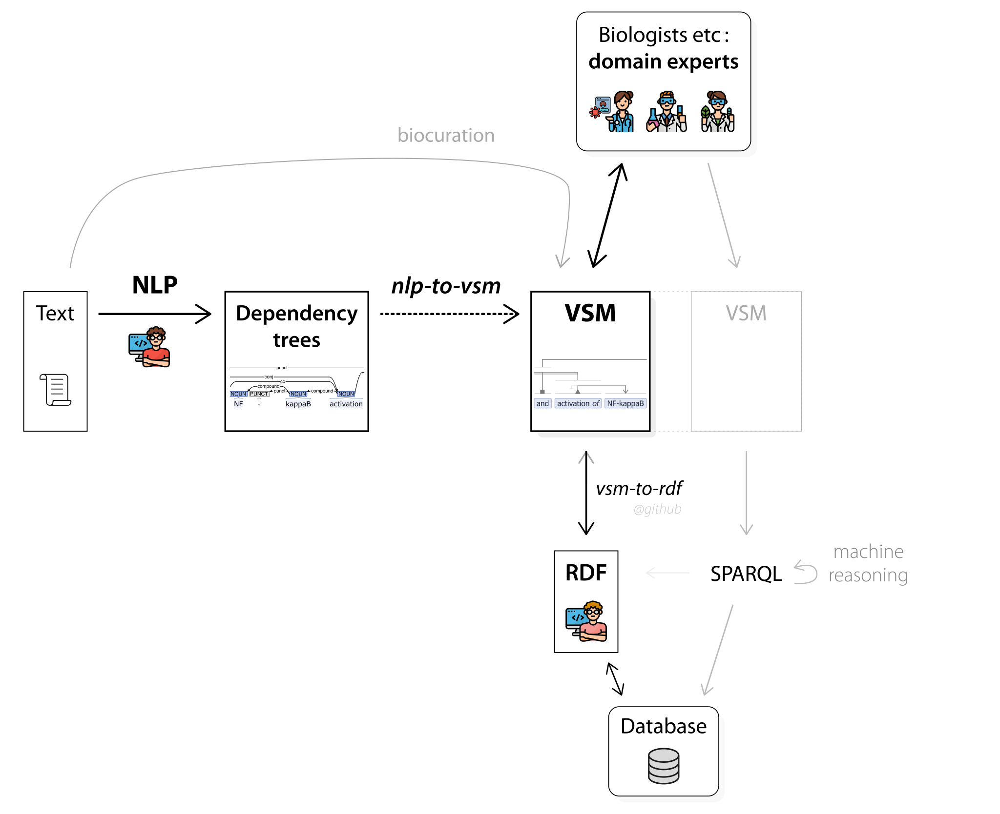
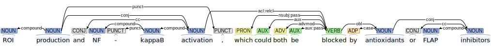

# nlp-to-vsm
**Converting NLP dependency trees, to semantic structures in VSM.**

This is a project for the 7th Biomedical Linked Annotation Hackathon ([BLAH7](https://blah7.linkedannotation.org)), with a focus on **Covid-19 literature**.

Overview:




## Goal
We want to map the dependency trees of NLP, onto the intuitive semantic structures of [VSM](https://vsm.github.io) (Visual Syntax Method).

"Covid-19" is the theme of the hackathon, so we would like to:  
• focus on **Covid-19 literature**,  
• design how Covid-19-related **syntax trees** can be **converted to VSM semantics**,  
• discuss how this can facilitate **semantic queries** over multidisciplinary Covid-19 knowledge, in a form that **biomedical end-users can grasp**.

### About VSM
VSM is an intuitive way to represent any contextualized knowledge on any topic, in a form that is semantically precise and also easy to understand. Biologists and others often tell they find VSM intuitive because it shows computable knowledge in a form close to _"how they think"_.

VSM is both a **knowledge representation** and an **interface** for entering, editing, or simply displaying knowledge in this form – the latter is the use-case for this project.  
All info on VSM is on [**vsm.github.io**](https://vsm.github.io), &nbsp;see esp. the [vsm-box](https://vsm.github.io/demo) demo and the [causalBuilder](https://mi2cast.github.io/causalBuilder) use case.

When context-rich knowledge is represented in VSM,  
• it can be placed in a [**vsm-box**](https://github.com/vsm/vsm-box) user-interface, where it becomes easy to read, **edit**, or correct by biologists – which may serve as feedback for NLP;  
• the knowledge is then **formalized and queryable** – via [**vsm-to-rdf**](https://github.com/vsm/vsm-to-rdf).


<br>

## Concrete project

### Project option 1:&nbsp; Enju –> VSM

We could use the output of the [Enju](https://mynlp.is.s.u-tokyo.ac.jp/enju) deep parser (Covid-19 corpus [coming soon](http://pubannotation.org/projects/LitCovid-sample-docs)), and design rules (or apply ML) to convert this to VSM-structures.  
This means that:
- all relevant entities should ideally be mapped onto a readable string + an identifier (e.g. URIs, see also [vsm-PubDictionaries](https://github.com/UniBioDicts/vsm-pubdictionaries) and  [paper](https://doi.org/10.37044/osf.io/gzfa8)),
- these term+ID units should be meaningfully connected with ‘VSM-connectors’ – which express an elementary semantics with: • triples (always `relation-entity has-subject subject-entity; has-object object-entity`), • couples, • lists, and • coreferences – as described in the [VSM paper](https://www.preprints.org/manuscript/202007.0486).

**Covid-19 literature** spans across **multiple** biological scales, and covers multiple research areas. Nevertheless, knowledge from any of these areas can be represented in the same, quick-to-understand semantic form of VSM (second image below).

For example this Enju output (from [PubAnnotation.org](http://www.pubannotation.org), bottom image), on a subject within molecular biology :


could be transformed into a VSM-sentence like this:


<br>

This VSM-sentence corresponds to the JSON below: (paste this in the larger textfield at [vsm demo](https://vsm.github.io/demo), to see an interactive, editable VSM-sentence):
<!-- Maybe someday this link will autofill it: https://vsm.github.io/demo?v=%7B%20terms%3A%20%5B%0A%20%20%20%20%7B%20str%3A%20%27production%20of%27%2C%20style%3A%20%27i11-13%27%2C%20classID%3A%20null%2C%20instID%3A%20null%20%7D%2C%0A%20%20%20%20%7B%20str%3A%20%27ROI%27%2C%20classID%3A%20null%2C%20instID%3A%20null%20%7D%2C%0A%20%20%20%20%7B%20str%3A%20%27and%27%2C%20classID%3A%20null%2C%20instID%3A%20null%2C%20descr%3A%20%27a%20set%20of%20items%27%20%7D%2C%0A%20%20%20%20%7B%20str%3A%20%27activation%20of%27%2C%20style%3A%20%27i10-13%27%2C%20classID%3A%20null%2C%20instID%3A%20null%20%7D%2C%0A%20%20%20%20%7B%20str%3A%20%27NF-kappaB%27%2C%20classID%3A%20null%2C%20instID%3A%20null%20%7D%2C%0A%20%20%20%20%7B%20str%3A%20%27could%27%2C%20classID%3A%20null%2C%20instID%3A%20null%20%7D%2C%0A%20%20%20%20%7B%20str%3A%20%27be%20blocked%20by%27%2C%20classID%3A%20null%2C%20instID%3A%20null%2C%20descr%3A%20%27%3D%5C%27is%20blocked%20by%5C%27%2C%20%3Dinverse%20of%20%5C%27blocks%5C%27%20or%20%5C%27blocking%20activity%5C%27%27%20%7D%2C%0A%20%20%20%20%7B%20str%3A%20%27antioxidant%27%2C%20classID%3A%20null%2C%20instID%3A%20null%20%7D%2C%0A%20%20%20%20%7B%20str%3A%20%27or%27%2C%20classID%3A%20null%2C%20instID%3A%20null%20%7D%2C%0A%20%20%20%20%7B%20str%3A%20%27FLAP%20Inhibitor%27%2C%20classID%3A%20null%2C%20instID%3A%20null%20%7D%0A%20%20%5D%2C%0A%20%20conns%3A%20%5B%0A%20%20%20%20%7B%20type%3A%20%27T%27%2C%20pos%3A%20%5B%20-1%2C%200%2C%201%20%5D%20%7D%2C%0A%20%20%20%20%7B%20type%3A%20%27T%27%2C%20pos%3A%20%5B%20-1%2C%203%2C%204%20%5D%20%7D%2C%0A%20%20%20%20%7B%20type%3A%20%27L%27%2C%20pos%3A%20%5B%202%2C%200%2C%203%20%5D%20%7D%2C%0A%20%20%20%20%7B%20type%3A%20%27T%27%2C%20pos%3A%20%5B%206%2C%20-1%2C%205%20%5D%20%7D%2C%0A%20%20%20%20%7B%20type%3A%20%27L%27%2C%20pos%3A%20%5B%208%2C%207%2C%209%20%5D%20%7D%2C%0A%20%20%20%20%7B%20type%3A%20%27T%27%2C%20pos%3A%20%5B%202%2C%206%2C%208%20%5D%20%7D%0A%20%20%5D%0A%7D -->
```javascript
{ terms: [
    { str: 'production of', classID: 'http://purl.obolibrary.org/obo/GO_1903409', style: 'i11-13', instID: null },
    { str: 'ROI', classID: 'http://purl.obolibrary.org/obo/CHEBI_26523', instID: null },
    { str: 'and', classID: null, instID: null },
    { str: 'activation of', classID: 'http://purl.obolibrary.org/obo/MI_2235', style: 'i10-13', instID: null },
    { str: 'NF-kappaB', classID: 'https://www.alliancegenome.org/gene/HGNC:7794', instID: null },
    { str: 'could', classID: null, instID: null },
    { str: 'be blocked by', classID: null, instID: null, descr: '=inverse of \'blocks\' or \'blocking activity\'' },
    { str: 'antioxidant', classID: null, instID: null },
    { str: 'or', classID: null, instID: null },
    { str: 'FLAP Inhibitor', classID: null, instID: null }
  ],
  conns: [
    { type: 'T', pos: [ -1, 0, 1 ] },
    { type: 'T', pos: [ -1, 3, 4 ] },
    { type: 'L', pos: [ 2, 0, 3 ] },
    { type: 'T', pos: [ 6, -1, 5 ] },
    { type: 'L', pos: [ 8, 7, 9 ] },
    { type: 'T', pos: [ 2, 6, 8 ] }
  ]
}
```

<br>

### Project option 2:&nbsp; UD –> VSM

We could also start from dependency structures in the [UD form](https://universaldependencies.org/introduction.html) (Universal Dependencies), and design rules to convert this to VSM.

For example the [Stanza](https://stanfordnlp.github.io/stanza) parser can produce UD [output](https://stanfordnlp.github.io/stanza/depparse.html#accessing-syntactic-dependency-information), also for biomedical and clinical text.  
This can be tested live on [stanza.run/bio](http://stanza.run/bio) : press Submit, and see the UD output and other useful information visualized at the bottom of the page.  
The Stanza UD output for the earlier example is:




<br>

## This project is particularly looking for:

- People with diverse expertise in NLP – (as this project owner's expertise is with biocurators, semantic tech, etc).
- It would be great to **have discussions** about dependency types and semantics, and to come up with ideas for:
  - how to **map dependency relations onto VSM semantics**, structurally (i.e. VSM-connectors),
  - how to **map certain terms onto IDs**, where possible (e.g. relation IDs, and prepositions as relations),
  - which **parts of a sentence to select** for conversion (e.g. discard filler text),
  - how to **simplify some parts** (e.g. the structure "production-of &rarr; ROI" could become one GO-term like "ROS biosynthesis").


### Further ideas

Once we can translate NLP output to VSM, we can automatically convert the [VSM to RDF](https://github.com/vsm/vsm-to-rdf) (among others), and store it in a triplestore.

- Then we could discuss how to **represent SPARQL queries in VSM** form as well.  
Making it easier to **formulate semantic queries** like this, could give our biomedical experts a more independent power to wield semantic technologies against Covid-19. It would give them a practical tool to query deep semantic knowledge structures, extracted from literature.


### A necessary ambition

This project is quite ambitious and may eventually become the topic of an X-people-year project. Therefore we want to emphasize that our main goal – apart from some preliminary coding – is to **initiate discussions and intellectual crossovers** towards achieving these goals.
