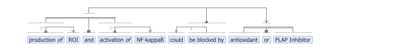

# nlp-to-vsm
**From NLP dependency structures to semantics in VSM.**

This is a project for the 7th Biomedical Linked Annotation Hackathon ([BLAH7](https://blah7.linkedannotation.org)).

## Goal
The goal is to map dependency trees generated by NLP onto the intuitive, semantic structures of [VSM](https://vsm.github.io) (Visual Syntax Method).

When contextualized knowledge from literature is represented in VSM, it becomes not only **formalized and queryable** (via [vsm-to-rdf](https://github.com/vsm/vsm-to-rdf)), it is also represented in a form that **biologists find intuitive** to interact with.
The extracted knowledge can be placed in a [vsm-box](https://github.com/vsm/vsm-box) user-interface, where it becomes easy to read, **edit**, and correct by biologists – and these edits can of course serve as feedback for NLP systems.

## What is VSM?
VSM is an elegant method that biologists (or any other non-IT specialists) can use to represent _any_ type of knowledge, with _any_ amount of context details (even context on context recursively), in a computable form.

VSM creates a unique combination of semantic **computability**, extreme **flexibility** (manageable via templates also), and human-oriented **intuitiveness**. This makes this technology both practical and comfortable for use by domain experts like biologists, chemists, etc.  

See [vsm.github.io](https://vsm.github.io) for all info on VSM, &nbsp;(esp. the [vsm-box demo](https://vsm.github.io/demo), and the [causalBuilder](https://mi2cast.github.io/causalBuilder) interface as a use-case).

<br>

## Concrete project

### Project option 1:&nbsp; Enju –> VSM

We could use the output of the [Enju](https://mynlp.is.s.u-tokyo.ac.jp/enju) deep parser, and design rules to convert this to VSM-structures.  
This means that:
- all relevant entities should (ideally) be mapped onto a readable string + an identifier (e.g. URIs via [vsm-PubDictionaries](https://github.com/UniBioDicts/vsm-pubdictionaries)), and
- these should be meaningfully connected with ‘VSM-connectors’, which express the elementary semantics of: triples (=`relation-entity has-subject subject-entity; has-object object-entity`), couples, lists, and coreferences, as described in the [VSM paper](https://www.preprints.org/manuscript/202007.0486).

For example this Enju output (from [PubAnnotation.org](http://www.pubannotation.org), bottom image) :


could be transformed into a VSM-sentence like this:




<br>

This VSM-sentence corresponds to the JSON below: (paste this in the larger textfield at [vsm demo](https://vsm.github.io/demo), to see an interactive, editable VSM-sentence):
<!-- Maybe someday this link will autofill it: https://vsm.github.io/demo?v=%7B%20terms%3A%20%5B%0A%20%20%20%20%7B%20str%3A%20%27production%20of%27%2C%20style%3A%20%27i11-13%27%2C%20classID%3A%20null%2C%20instID%3A%20null%20%7D%2C%0A%20%20%20%20%7B%20str%3A%20%27ROI%27%2C%20classID%3A%20null%2C%20instID%3A%20null%20%7D%2C%0A%20%20%20%20%7B%20str%3A%20%27and%27%2C%20classID%3A%20null%2C%20instID%3A%20null%2C%20descr%3A%20%27a%20set%20of%20items%27%20%7D%2C%0A%20%20%20%20%7B%20str%3A%20%27activation%20of%27%2C%20style%3A%20%27i10-13%27%2C%20classID%3A%20null%2C%20instID%3A%20null%20%7D%2C%0A%20%20%20%20%7B%20str%3A%20%27NF-kappaB%27%2C%20classID%3A%20null%2C%20instID%3A%20null%20%7D%2C%0A%20%20%20%20%7B%20str%3A%20%27could%27%2C%20classID%3A%20null%2C%20instID%3A%20null%20%7D%2C%0A%20%20%20%20%7B%20str%3A%20%27be%20blocked%20by%27%2C%20classID%3A%20null%2C%20instID%3A%20null%2C%20descr%3A%20%27%3D%5C%27is%20blocked%20by%5C%27%2C%20%3Dinverse%20of%20%5C%27blocks%5C%27%20or%20%5C%27blocking%20activity%5C%27%27%20%7D%2C%0A%20%20%20%20%7B%20str%3A%20%27antioxidant%27%2C%20classID%3A%20null%2C%20instID%3A%20null%20%7D%2C%0A%20%20%20%20%7B%20str%3A%20%27or%27%2C%20classID%3A%20null%2C%20instID%3A%20null%20%7D%2C%0A%20%20%20%20%7B%20str%3A%20%27FLAP%20Inhibitor%27%2C%20classID%3A%20null%2C%20instID%3A%20null%20%7D%0A%20%20%5D%2C%0A%20%20conns%3A%20%5B%0A%20%20%20%20%7B%20type%3A%20%27T%27%2C%20pos%3A%20%5B%20-1%2C%200%2C%201%20%5D%20%7D%2C%0A%20%20%20%20%7B%20type%3A%20%27T%27%2C%20pos%3A%20%5B%20-1%2C%203%2C%204%20%5D%20%7D%2C%0A%20%20%20%20%7B%20type%3A%20%27L%27%2C%20pos%3A%20%5B%202%2C%200%2C%203%20%5D%20%7D%2C%0A%20%20%20%20%7B%20type%3A%20%27T%27%2C%20pos%3A%20%5B%206%2C%20-1%2C%205%20%5D%20%7D%2C%0A%20%20%20%20%7B%20type%3A%20%27L%27%2C%20pos%3A%20%5B%208%2C%207%2C%209%20%5D%20%7D%2C%0A%20%20%20%20%7B%20type%3A%20%27T%27%2C%20pos%3A%20%5B%202%2C%206%2C%208%20%5D%20%7D%0A%20%20%5D%0A%7D -->
```javascript
{ terms: [
    { str: 'production of', classID: 'http://purl.obolibrary.org/obo/GO_1903409', style: 'i11-13', instID: null },
    { str: 'ROI', classID: 'http://purl.obolibrary.org/obo/CHEBI_26523', instID: null },
    { str: 'and', classID: null, instID: null },
    { str: 'activation of', classID: 'http://purl.obolibrary.org/obo/MI_2235', style: 'i10-13', instID: null },
    { str: 'NF-kappaB', classID: 'https://www.alliancegenome.org/gene/HGNC:7794', instID: null },
    { str: 'could', classID: null, instID: null },
    { str: 'be blocked by', classID: null, instID: null, descr: '=inverse of \'blocks\' or \'blocking activity\'' },
    { str: 'antioxidant', classID: null, instID: null },
    { str: 'or', classID: null, instID: null },
    { str: 'FLAP Inhibitor', classID: null, instID: null }
  ],
  conns: [
    { type: 'T', pos: [ -1, 0, 1 ] },
    { type: 'T', pos: [ -1, 3, 4 ] },
    { type: 'L', pos: [ 2, 0, 3 ] },
    { type: 'T', pos: [ 6, -1, 5 ] },
    { type: 'L', pos: [ 8, 7, 9 ] },
    { type: 'T', pos: [ 2, 6, 8 ] }
  ]
}
```

<br>

### Project option 2:&nbsp; UD –> VSM

We could also start from dependency structures in the [UD form](https://universaldependencies.org/introduction.html) (Universal Dependencies), and design rules to convert this to VSM.

For example the [Stanza](https://stanfordnlp.github.io/stanza) parser can produce UD [output](https://stanfordnlp.github.io/stanza/depparse.html#accessing-syntactic-dependency-information), also for biomedical and clinical text.  
This can be tested live on [stanza.run/bio](http://stanza.run/bio) : press Submit, and see the UD output and other useful information visualized at the bottom of the page.


<br>

## This project is particularly looking for:

- People who know more about NLP.
- It would be great to **discuss** the ins and outs of dependency types,
- and to come up with clever **ideas for mapping dependency relations onto VSM semantics**, structurally (i.e. VSM-connectors),
- and for **mapping certain terms onto IDs**, where possible (e.g. relation IDs, and prepositions as relations),
- and for **what parts of a sentence to convert** (e.g. discard filler text),
- and perhaps **to simplify some parts** (e.g. "production-of --> ROI" could become one GO-term like "ROS biosynthesis").


<br>

## Further ideas

### Literature topic

We could use literature on COVID-19, which is this year's focus area for BLAH7.


### Next opportunities

If we would succeed in translating NLP output to VSM, then we could automatically [convert the VSM to RDF](https://github.com/vsm/vsm-to-rdf) and store it in a triplestore (or convert it to any other format).

Next, if we could also represent SPARQL query-patterns in VSM-form – which biologists can edit in a [vsm-box](https://github.com/vsm/vsm-box), then biologists would have a user-friendly tool for querying detailed, semantic knowledge structures, extracted from text.
